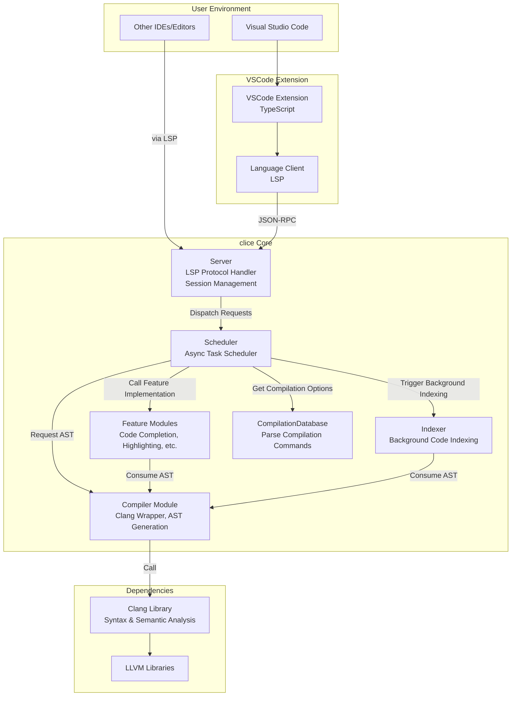

# clice

  

## What is clice?
"More flexible, more efficient" C++ language server !!

::: details Detailed Description
A language server written in C++ that primarily supports C++ programming, following Microsoft's [LSP (Language Server Protocol)](https://learn.microsoft.com/en-us/visualstudio/extensibility/language-server-protocol?view=vs-2022). The core goal of the project is to provide functionality similar to clangd, but solve the problems of clangd's slow development and difficulty in receiving significant contributions, while also trying to better support C++20 modules and optimize certain performance/memory aspects.
:::
## Where does clice work?

## clice Makes Its Grand Entrance
Now that you understand clice, let's navigate to the directory guide to check out the tutorials and proceed with installation...configuration...

[Directory Navigation](./start-install.md)